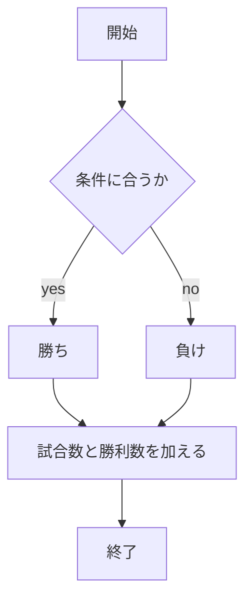
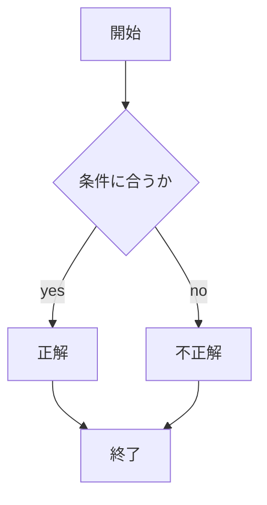
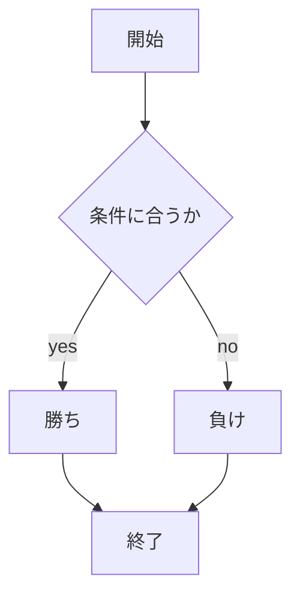

# webpro_06
## このプログラムについて
app5.jsには，じゃんけん，数当て，あっち向いてホイの３つのゲームを作成した．じゃんけんは，ユーザーが"グー"，"チョキ"，"パー"をユーザーが入力して，コンピュータとのじゃんけんを行う．数当てゲームは，ユーザーが1~5の数字を選び，コンピュータがランダムで1〜5の数字を選ぶ．この数字を一致させることを目指すゲームとなっている．あっち向いてホイは，ランダムに選ばれた方向（↑，→，←，↓）をユーザーが予想してあてるゲームとなっている．
## ファイル一覧
ファイル名 | 説明
-|-
add5.js | プログラム本体
public/janken.html | じゃんけんの開始画面
views/janken.ejs | じゃんけんのテンプレートファイル
public/guess.html | 数当てゲームの開始画面
views/guess.ejs | 数当てゲームのテンプレートファイル
public/course.html | あっち向いてホイの開始画面
views/course.ejs | あっち向いてホイのテンプレートファイル

## じゃんけんを行うための手順
1. ```add5.js``` をターミナルで起動する．
1. Webブラウザで```localhost:8080/public/janken.html```にアクセスする．
1. 開始時に入力欄にグー，チョキ，パーのいずれかを入力し送信ボタンを押す．
1. コンピュータもランダムに出す手が決まり勝ち負けが判定される．
1. 勝利した場合"勝ち"，敗北した場合は"負け"と表示される．
1. じゃんけんが一回終了すると画面には試合数と勝利数が加算される．

## 数当てゲームを行うための手順
1. ```add5.js``` をターミナルで起動する．
1. Webブラウザで```localhost:8080/public/guess.html```にアクセスする．
1. 開始時は入力欄に数(1~5)を予想して入力し送信ボタンを押す．
1. コンピュータもランダムに数が決定される．
1. 数が一致した場合"正解"，不一致だった場合"不正解"と表示される．

## あっち向いてホイを行うための手順
1. ```add5.js``` をターミナルで起動する．
1. Webブラウザで```localhost:8080/public/course.html```にアクセスする．
1. ゲーム開始時に，入力欄に方向(→，←，↑，↓)を予想して入力し送信ボタンを押す．
1. 入力と同時にコンピュータもランダムで方向が決定する．
1. 一致した場合"勝ち"，不一致だった場合"負け"と表示される．


