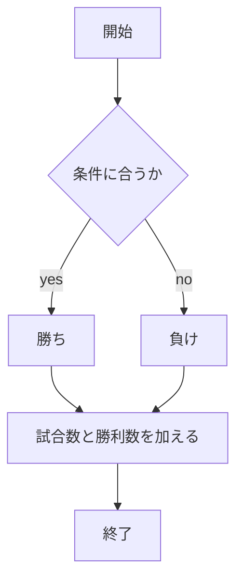
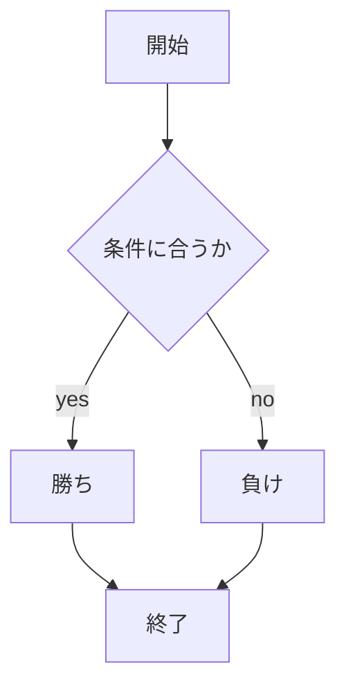

# webpro_06
## このプログラムについて
app5.jsには，じゃんけん，数当て，あっち向いてホイの３つのゲームを作った．じゃんけんは，ユーザーが"グー"，"チョキ"，"パー"を入力してコンピュータとのじゃんけんを行う．
数当てゲームは，ユーザーが1~5の数字を選び，コンピュータがランダムで1〜5の数字を選ぶ．この数字を一致させることを目指すゲームとなっている．
あっち向いてホイは，ランダムに選ばれた方向（↑，→，←，↓）をユーザーが予想しあてるゲームとなっている．
## ファイル一覧
ファイル名 | 説明
-|-
add5.js | プログラム本体
public/janken.html | じゃんけんの開始画面
views/janken.ejs | じゃんけんのテンプレートファイル
public/guess.html | 数当てゲームの開始画面
views/guess.ejs | 数当てゲームのテンプレートファイル
public/course.html | あっち向いてホイの開始画面
views/course.ejs | あっち向いてホイのテンプレートファイル

## 実装内容
1.じゃんけん
```javascript
app.get("/janken", (req, res) => {
  let hand = req.query.hand;
  let win = Number( req.query.win );
  let total = Number( req.query.total );
  console.log( {hand, win, total});
  const num = Math.floor( Math.random() * 3 + 1 );
  let cpu = '';
  if( num==1 ) cpu = 'グー';
  else if( num==2 ) cpu = 'チョキ';
  else cpu = 'パー';
  // ここに勝敗の判定を入れる
  // 今はダミーで人間の勝ちにしておく
  let judgement = '';
  if (hand === cpu) {
    judgement = '引き分け';
  } else if (
    (hand === 'グー' && cpu === 'チョキ') ||
    (hand === 'チョキ' && cpu === 'パー') ||
    (hand === 'パー' && cpu === 'グー')
  ) {
    judgement = '勝ち';
    win += 1;  
  } else {
    judgement = '負け';  
  }
  
  total += 1;
  const display = {
    your: hand,
    cpu: cpu,
    judgement: judgement,
    win: win,
    total: total
  }
  res.render( 'janken', display );
});
```
2.数当てゲーム
```javascript
app.get("/guess",(req, res) => {
  let guess = req.query.guess;
  console.log( {guess});
  const num = Math.floor( Math.random() * 5 + 1 );
  let cpu = '';
  if( num==1 ) cpu = '1';
  else if( num==2 ) cpu = '2';
  else if( num==3 ) cpu = '3';
  else if( num==4 ) cpu = '4';
  else cpu = '5';
  let judgement = '';
  if(guess == cpu){
    judgement = '正解！'
  } else {
    judgement = '不正解'
  }
  const display = {
    your: guess,
    cpu: cpu,
    judgement: judgement,
    
  }
  res.render( 'guess', display );
});
```
2.あっち向いてホイ
```javascript
app.get("/course",(req, res) => {
  let course = req.query.course;
  console.log( {course});
  const num = Math.floor( Math.random() * 4 + 1 );
  let cpu = '';
  if( num==1 ) cpu = '↑';
  else if( num==2 ) cpu = '→';
  else if( num==3 ) cpu = '←';
  else cpu = '↓';
  let judgement = '';
  if(course == cpu){
    judgement = '勝ち'
  } else {
    judgement = '負け'
  }
  const display = {
    your: course,
    cpu: cpu,
    judgement: judgement,
    
  }
  res.render( 'course', display );
});
```
## じゃんけんを行うための手順
1. ```add5.js``` を起動する
1. Webブラウザでlocalhost:8080/public/janken.htmlにアクセスする
1. 自分の手を入力する

## 数当てゲームを行うための手順
1. ```add5.js``` を起動する
1. Webブラウザでlocalhost:8080/public/guess.htmlにアクセスする
1. 数(1~5)を予想して入力する

## あっち向いてホイを行うための手順
1. ```add5.js``` を起動する
1. Webブラウザでlocalhost:8080/public/course.htmlにアクセスする
1. 方向(→，←，↑，↓)を予想して入力する

## ゲームのフローチャート
1.じゃんけん

2.数当てゲーム，あっち向いてホイ

